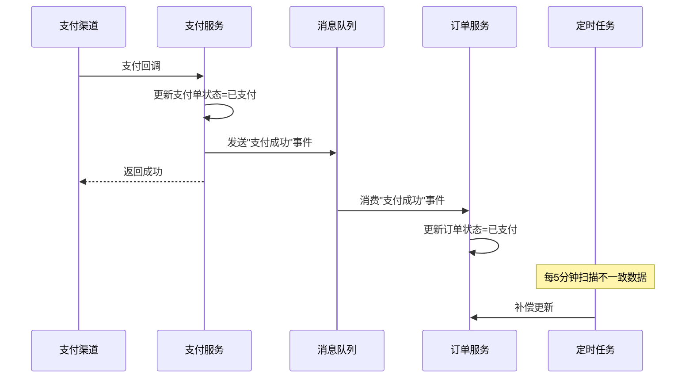

# 第 12 章：状态设计：业务系统最容易失控的地方

## 1. 从一个真实问题开始

线上告警：一笔订单用户已经收到退款，但订单状态还是"退款中"。客服后台显示的也是"退款中"，但用户打电话来说"钱已经到了"。

排查后发现：支付渠道的退款回调已经到达了系统，退款表的状态确实更新为了"退款成功"。但更新订单主状态的那行代码，因为和另一个并发请求产生了乐观锁冲突，更新失败了，而且失败后没有重试。

再深入看，这不是一个偶发的并发问题，而是一个系统性的设计缺陷。退款状态、支付状态、订单状态分散在三张表里，由三段不同的代码分别更新。哪个先更新、哪个后更新，取决于回调的时序和代码的执行顺序。没有一个统一的地方来协调这三个状态的一致性。

更头疼的是，产品经理问了一个简单的问题："告诉我，订单在什么情况下算'已完成'？"

工程师翻了半个小时代码，给出了这样的回答：订单状态为 COMPLETED，或者订单状态为 PAID 且物流状态为 SIGNED 且签收超过 7 天且没有进行中的退款且没有进行中的售后。

这不是"定义"，这是"考古"。当一个业务概念需要通过翻代码才能回答时，状态设计已经失控了。

## 2. 问题为什么会变复杂

### 2.1 状态不是一个字段，而是一个模型

很多工程师把"状态"理解为一个数据库字段：status INT。需要新状态就加一个取值，需要判断状态就写一个 if。

但真实业务系统中的"状态"是一个多维的概念。以一笔电商订单为例，它至少涉及以下维度的状态：

- **订单主状态**：待支付、已支付、已发货、已完成、已取消、已关闭
- **支付状态**：未支付、支付中、支付成功、支付失败
- **物流状态**：未发货、已发货、运输中、已签收、已拒收
- **退款状态**：无退款、退款申请中、退款处理中、退款成功、退款失败
- **售后状态**：无售后、售后申请中、处理中、已完结

如果把这些维度全部压缩到一个 status 字段里，这个字段会需要几十种取值来表达所有的组合。而且很多组合是语义上矛盾的——比如"已完成+退款中"在你的 status 枚举里是一个值还是两个值？

### 2.2 状态之间的依赖关系是隐含的

在上面的例子中，订单状态依赖支付状态（支付成功后才能变为已支付），订单状态也依赖退款状态（退款成功后订单可能需要变为已退款）。但这种依赖关系通常没有被显式建模，而是散落在各个业务方法的 if-else 里。

这就带来了两个问题：

**一是状态不一致的窗口。** 当退款回调到达时，退款表的状态更新了，但订单表的状态还没更新。在这个窗口期内，两个表的数据是矛盾的。如果恰好有请求在这个窗口期查询，就会看到不一致的数据。

**二是状态流转规则的碎片化。** 订单能不能取消，取决于当前的支付状态、物流状态、退款状态。但这个判断逻辑可能写在 OrderService、PaymentService、RefundService 各一份，而且三份的判断条件不完全一样——因为是不同时间、不同人写的。

### 2.3 业务演进不断叠加状态复杂度

系统上线第一个月，状态设计通常是清晰的。复杂度的积累来自后续的业务演进：

- 第二个月：加了取消功能，status 多了 CANCELLED；
- 第三个月：加了超时关闭，status 多了 CLOSED，但 CLOSED 和 CANCELLED 的区别是什么？代码里开始出现 if (status == CANCELLED || status == CLOSED) 的合并判断；
- 第五个月：加了部分退款，退款表多了 PARTIAL_REFUND 状态，但订单的 status 怎么表达"部分退款"？加了一个 PARTIALLY_REFUNDED？还是维持 PAID 不变但加一个 has_refund 标记？
- 第八个月：加了预售模式，支付分成定金和尾款两笔，支付状态需要表达"定金已付尾款未付"……

每次加新状态，工程师的做法通常是"在现有字段上加一个新值"。看起来改动最小，但日积月累，状态字段变成了一个无法理解的大杂烩。

## 3. 核心概念解释

### 3.1 什么是状态机

状态机是描述一个对象生命周期的模型。它包含三个要素：

- **状态（State）**：对象在某个时刻的存在形式。比如订单的"待支付""已支付"。
- **事件（Event）**：触发状态变化的动作。比如"用户支付""系统超时""客服取消"。
- **转换（Transition）**：从一个状态到另一个状态的映射，由事件触发。比如"待支付 + 用户支付 → 已支付"。

状态机的核心价值在于：**它把所有合法的状态转换明确列举出来。** 任何不在转换列表里的状态变化都是非法的，应该被拒绝。

### 3.2 状态维度分离

当一个对象有多个维度的状态时，不应该用一个字段来表达所有组合，而应该拆分为多个独立的状态字段，每个字段管理一个维度。

比如订单可以拆分为：

```sql
ALTER TABLE orders ADD COLUMN order_status VARCHAR(32);    -- 订单主状态
ALTER TABLE orders ADD COLUMN pay_status VARCHAR(32);      -- 支付状态
ALTER TABLE orders ADD COLUMN ship_status VARCHAR(32);     -- 物流状态
```

每个维度有自己的状态机：

**订单主状态：** CREATED → CONFIRMED → COMPLETED → CLOSED
**支付状态：** UNPAID → PAYING → PAID → REFUNDED
**物流状态：** UNSHIPPED → SHIPPED → IN_TRANSIT → SIGNED → REJECTED

这样做的好处是：
- 每个维度的状态值少了，逻辑更清晰；
- 不同维度可以独立变化，不需要创造"已支付未发货""已支付已发货未签收"这样的组合状态；
- 查询时可以按维度精确筛选。

代价是：
- 查询"订单当前的整体状态"需要组合多个字段；
- 多个维度之间的约束关系需要在业务层保证（比如只有 pay_status = PAID 之后，ship_status 才能变为 SHIPPED）。

### 3.3 状态、行为、规则的关系

状态不是孤立存在的。围绕状态有三层东西需要设计：

**状态定义**：有哪些状态、每个状态的含义。
**转换规则**：什么条件下可以从 A 变到 B。
**状态行为**：进入某个状态后需要做什么（副作用）。

比如订单进入"已支付"状态后：
- 触发库存扣减；
- 触发优惠券核销确认；
- 发送支付成功通知；
- 启动超时自动关闭的计时器。

这些"进入状态后的行为"如果散落在各个 Service 里，很容易遗漏或执行顺序出错。好的做法是把它们和状态转换绑定在一起——当状态 A → B 发生时，自动触发对应的行为列表。

## 4. 常见误区

### 4.1 用一个字段表达所有维度

前面已经讲过了。一个 status 字段承载了订单状态、支付状态、物流状态、退款状态，导致状态值膨胀到十几个，且语义混乱。

### 4.2 状态转换没有集中管控

状态变更散落在各个 Service 方法里：OrderService 里可以改 status，PaymentService 里也可以改 status，RefundService 里也可以改 status。

没有一个统一的地方来验证"这个转换是否合法"。结果就是偶尔出现非法的状态数据——比如从"已完成"直接跳到"待支付"。

### 4.3 重复请求导致状态错乱

支付回调可能因为网络原因重复到达。如果第一次回调成功把状态改为"已支付"，并触发了发货流程。第二次回调到达时，如果没有幂等检查，可能又把状态改一次，再触发一次发货。

更隐蔽的情况是：第一次回调和第二次回调几乎同时到达，两个线程同时读到 status = PENDING_PAYMENT，然后各自把 status 改为 PAID。虽然最终状态是对的，但后续的发货流程可能被触发了两次。

### 4.4 只存最新状态，不存变更历史

很多系统只在订单表里存一个 status 字段，每次更新直接覆盖。这样做的问题是：当线上出现数据异常时，无法回溯状态是怎么一步步变过来的。

比如一个订单 status = REFUNDED，但用户说自己没有申请退款。没有状态变更日志，就无法确认这个退款是用户操作的、客服操作的、还是系统自动处理的。

### 4.5 状态判断逻辑和业务逻辑混合

代码中经常出现这样的逻辑：

```java
if (order.getStatus() == 1 || order.getStatus() == 2) {
    // 可以取消
} else if (order.getStatus() == 3 && order.getPayStatus() == 2) {
    // 已发货且已支付，不能取消，只能退款
} else if (order.getStatus() == 5 && refundService.hasActiveRefund(orderId)) {
    // 有进行中的退款
}
```

这段代码的问题是：状态判断和业务行为混在一起，新来的工程师很难看懂"什么状态下可以做什么"。状态判断应该被封装在模型层，业务代码只需要调用一个方法：

```java
if (order.canCancel()) {
    order.cancel(reason);
}
```

## 5. 设计方法

### 5.1 状态设计的基本原则

**原则一：一个字段只表达一个维度的状态。**

不要让 order_status 同时承载"支付情况"和"物流情况"。拆分为 pay_status 和 ship_status，让每个字段的含义单一明确。

**原则二：所有合法的状态转换必须被显式定义。**

不管是用状态机框架还是用一个简单的 Map，都要有一个集中的地方列出"从 A 可以到 B，从 B 可以到 C 和 D"。任何不在列表里的转换都应该被拒绝。

**原则三：状态变更必须有日志。**

核心业务对象的每次状态变更都应该记录：谁、什么时间、从什么状态、变到什么状态、原因是什么。

**原则四：状态变更必须考虑幂等。**

相同的事件（比如支付回调）多次到达时，系统的行为应该是一致的。第二次收到"支付成功"的回调时，如果订单已经是"已支付"状态，应该直接返回成功，而不是重新执行一遍后续流程。

**原则五：状态变更的副作用应该和状态转换绑定。**

进入某个状态后需要做的事情（发通知、扣库存、核销优惠券），应该和状态转换机制绑定，而不是散落在各个业务方法里。

### 5.2 简易状态机实现

不一定需要引入复杂的状态机框架。对于大多数业务系统，一个简单的状态机就够了：

```java
public class OrderStateMachine {
    
    private static final Map<OrderStatus, Map<OrderEvent, OrderStatus>> TRANSITIONS = Map.of(
        PENDING_PAYMENT, Map.of(
            PAY_SUCCESS, PAID,
            TIMEOUT, CLOSED,
            USER_CANCEL, CANCELLED
        ),
        PAID, Map.of(
            SHIP, SHIPPED,
            APPLY_REFUND, REFUNDING
        ),
        SHIPPED, Map.of(
            CONFIRM_RECEIPT, COMPLETED
        ),
        REFUNDING, Map.of(
            REFUND_SUCCESS, REFUNDED,
            REFUND_FAIL, PAID
        )
    );
    
    public OrderStatus transition(OrderStatus current, OrderEvent event) {
        Map<OrderEvent, OrderStatus> eventMap = TRANSITIONS.get(current);
        if (eventMap == null || !eventMap.containsKey(event)) {
            throw new IllegalStateException(
                "非法状态转换: " + current + " + " + event);
        }
        return eventMap.get(event);
    }
}
```

这段代码不到 30 行，但它把所有的状态转换规则集中在了一个地方。新来的工程师看一眼就知道"订单有哪些状态、每个事件触发什么转换"。

### 5.3 处理并发和重复请求

**幂等检查**：在执行状态变更前，先检查当前状态是否已经是目标状态。如果是，直接返回成功。

```java
public void handlePayCallback(String orderId, String paymentId) {
    Order order = orderRepository.findById(orderId);
    if (order.getPayStatus() == PayStatus.PAID) {
        // 已经处理过了，直接返回
        log.info("重复的支付回调，订单已支付: {}", orderId);
        return;
    }
    // 执行状态变更
    order.markAsPaid(paymentId);
    orderRepository.save(order);
}
```

**乐观锁**：在更新状态时使用版本号或状态条件，防止并发覆盖。

```sql
UPDATE orders SET status = 'PAID', version = version + 1
WHERE id = ? AND status = 'PENDING_PAYMENT' AND version = ?
```

如果更新影响行数为 0，说明有并发冲突，需要重新读取数据再判断。

**去重表**：对于外部回调（如支付回调），用唯一键做去重。把回调的唯一标识（比如 payment_id + callback_type）存入去重表，如果插入失败说明已经处理过。

## 6. 业务案例

### 6.1 案例：支付状态和订单状态的协调

一个电商系统的支付流程涉及两个核心状态的协调：支付单状态和订单状态。

**第一版设计：** 用户点击支付 → 调用支付渠道 → 等待回调 → 更新支付单状态为已支付 → 更新订单状态为已支付。

问题：如果更新订单状态失败了（比如数据库主从切换），支付单是已支付但订单是待支付。用户看到的可能是"支付成功"的页面但订单列表还是"待支付"。

**第二版设计：** 支付回调处理改为事务操作，支付单和订单状态在同一个事务内更新。

问题：如果支付单和订单在不同的数据库或不同的服务里，无法用本地事务保证。即使在同一个数据库里，事务范围过大也会影响并发性能。

**第三版设计（最终方案）：**

1. 支付回调到达后，先更新支付单状态为已支付（这一步必须成功，因为支付渠道不会一直重试回调）；
2. 然后发送一条"支付成功"的内部事件（写入消息表或消息队列）；
3. 订单服务消费这条事件，更新订单状态为已支付；
4. 如果订单状态更新失败，事件会重试，直到成功；
5. 同时有一个定时任务，扫描"支付单已支付但订单未支付"的不一致数据，做补偿。

这个设计的权衡点在于：接受了"支付单已支付和订单状态更新之间有短暂的不一致窗口"，换来了"最终一致性"和"系统的容错能力"。



### 6.2 案例：退款状态机设计

退款是状态设计中复杂度最高的场景之一，因为它涉及多方状态的协调：

- 退款单自身的状态；
- 订单的退款状态标记；
- 支付渠道的退款进度；
- 优惠券是否需要退回；
- 库存是否需要释放。

**退款单状态机设计：**

```
PENDING（待处理）
  ↓ [提交退款]
PROCESSING（处理中）
  ↓ [渠道退款成功]  → SUCCESS（退款成功）
  ↓ [渠道退款失败]  → FAILED（退款失败）
  ↓ [超时未响应]    → TIMEOUT（超时）

FAILED
  ↓ [重新发起]      → PROCESSING
  
TIMEOUT
  ↓ [人工处理]      → PROCESSING / CLOSED（人工关闭）
```

**关键设计决策：**

1. 退款单是独立实体，有自己的状态机。订单表通过一个 refund_flag 字段标记"是否有进行中的退款"，而不是在订单状态里表达退款。

2. 退款成功后的副作用（退还优惠券、释放库存、发送通知）通过事件触发，而不是在退款回调处理方法里同步调用。这样即使某个副作用失败，退款本身的状态不受影响。

3. 退款失败后允许重新发起，状态从 FAILED 回到 PROCESSING。这个转换在状态机里是显式定义的，而不是靠业务代码判断。

## 7. 架构判断清单

- 如果一个状态字段需要靠注释解释十几种含义，说明状态模型已经失控，需要拆分维度。
- 如果修改状态转换逻辑需要在三个以上的代码位置同步修改，说明状态管理缺少集中化。
- 如果线上出现了"不可能存在"的状态数据（比如已取消+已支付），说明缺少状态转换的合法性校验。
- 如果排查线上问题时无法还原一个对象的状态变化历史，说明缺少状态变更日志。
- 如果同一个回调处理两次会产生不同的结果或重复的副作用，说明缺少幂等设计。
- 如果"这个状态下用户能做什么"这个问题需要翻五个文件才能回答，说明状态相关的业务规则没有内聚到模型层。
- 如果两个维度的状态（比如订单状态和支付状态）的一致性只靠代码逻辑保证，没有补偿机制，说明在异常场景下大概率会出现不一致。

## 8. 本章小结

状态设计是业务系统中最容易被低估的设计工作。很多工程师把状态当作"一个字段"来处理，但在实际业务中，状态是一个涉及多个维度、多个参与方、多种异常情况的复杂模型。

状态设计出问题的症状通常表现为：数据不一致、状态字段含义混乱、排查问题时无法还原过程、新增业务场景时状态值疯狂膨胀。这些问题的根源大多可以追溯到：状态维度没有拆分、状态转换没有集中管控、幂等没有做好、状态变更没有日志。

对于有状态的核心业务对象（订单、支付、退款、优惠券、审批），投入时间做一个清晰的状态模型，是收益最高的架构投入之一。它不需要引入复杂的框架，一个简单的状态转换表加上状态变更日志表，就能避免后续大量的数据修复和问题排查工作。
