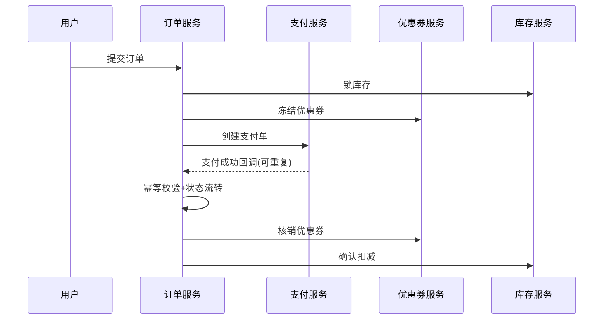

# 第 32 章：支付系统架构设计

## 1. 从一个真实问题开始

在多数团队里，这一章对应的问题都不会以“架构问题”的名字出现。它通常伪装成需求延期、联调扯皮、线上告警、回滚失败，或者“这块没人敢动”。

以电商场景为例：订单、支付、优惠券、库存、消息、对账往往在不同阶段被不同团队扩展。只要业务继续增长，原本能跑的实现就会逐渐暴露结构性缺口。本章不从定义开始，而从这些缺口出发，讨论如何把问题收敛到可设计、可落地、可演进的方案。

## 2. 问题为什么会变复杂

- **变化叠加**：业务规则不断追加，历史兼容长期保留。
- **边界漂移**：模块责任写在口头共识里，没有固化到契约。
- **协作放大**：多人并行开发后，局部优化被系统性副作用放大。
- **反馈滞后**：设计缺陷往往在高峰期、故障期才暴露。

复杂性不是一次设计失误，而是长期“短期最优”叠加的结果。真正的工程能力，在于识别拐点并主动重建结构。

## 3. 核心概念解释

这一章的核心概念可以归结为三句工程话：

1. 先定义边界，再讨论实现；
2. 先定义约束，再讨论灵活；
3. 先定义演进路径，再讨论一次性交付。

你可以把架构理解成“管理复杂关系的技术”。关系包括：模块关系、数据关系、状态关系、团队关系、时间关系（今天与未来）。只要这些关系可见、可讨论、可验证，系统就不会失控。

## 4. 常见误区

1. **只谈技术名词，不谈业务上下文**：方案听上去先进，落地却无收益。
2. **只做功能闭环，不做风险闭环**：上线能过，故障不可控。
3. **只看局部性能，不看整体吞吐**：热点优化成功，链路瓶颈仍在。
4. **只靠经验，不做机制**：离开关键人，系统不可维护。
5. **只重构代码，不重构模型**：语义混乱仍然存在。

## 5. 设计方法

### 5.1 章节通用落地步骤

1. 用一页纸写清本章主题在当前系统的“真实触发问题”；
2. 拆出 3-5 个可验证目标（例如响应时间、失败恢复时间、改动影响面）；
3. 画出最小可讨论模型（流程/状态/边界图三选一）；
4. 给出两套可选方案并写明取舍；
5. 拆成小步发布计划：灰度、回滚、监控、复盘。

### 5.2 示例流程图（Mermaid）

### 5.3 快速检查清单

- 是否定义了 owner、接口契约和状态语义？
- 是否有幂等、重试、超时、补偿策略？
- 是否给出灰度发布与回滚脚本？
- 是否量化了收益与风险上限？

## 6. 业务案例

本章建议沿用统一业务主线：**订单创建 → 支付 → 取消/退款 → 通知/对账**。

- 在需求正常路径上验证核心能力；
- 在异常路径上验证幂等与补偿；
- 在高峰流量上验证性能与稳定性；
- 在历史数据上验证兼容与迁移。

### 案例时序图（Mermaid）

## 7. 架构判断清单

- 如果改一个字段要跨多个团队同步上线，边界大概率有问题。
- 如果异常分支比主分支还长，状态模型需要重建。
- 如果事故复盘只到“人为失误”，机制设计还没完成。
- 如果架构文档无法指导测试用例，说明方案不可执行。
- 如果重构无法拆成小步验证，说明风险模型不完整。

## 8. 本章小结

本章的关键不在于“记住概念”，而在于形成一个稳定动作：先看问题类型，再看边界，再看约束，最后才是技术选型。工程师的架构成长，核心是把经验变成可复用的方法，把方法变成团队机制。

接下来对应章节写作时，请在本章框架上补入该主题的专属内容：特定术语、反例、设计步骤、案例细节与量化指标。若主题涉及对外协作，务必增加接口契约与责任边界表；若主题涉及数据与状态，务必增加状态机与补偿流程。
